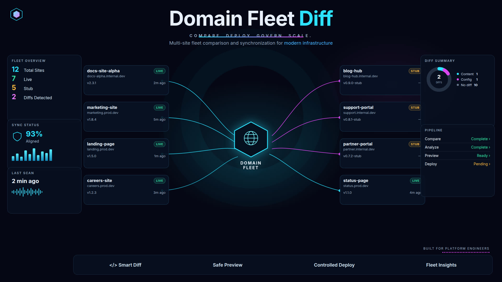

# Domain Fleet Diff

Inventory a multi-site fleet, tell a Hostinger placeholder from a real build, and print the next merge-ready step for each domain.

The owner keeps one hub repo (the sample calls it `grummpy/my_domains`). Each small site has its own GitHub repo and its own bot account. Hostinger deploys that repo. This tool reads a `fleet.toml` manifest from the hub and reports what is still the default page, what has drifted, and which pull requests a bot may merge.

It does not merge, deploy, or store tokens.

## Install

```bash
python -m pip install -e ".[dev]"
domain-fleet scan
```

`domain-fleet` is the installed command. `python -m domain_fleet scan` is the same entry point when the install location is not on `PATH`. Python 3.11 or newer. The runtime has no third-party dependencies.

## Scan

The default scan is offline. It uses the packaged sample fleet, so a demo does not call GitHub or Hostinger.

```bash
domain-fleet scan
domain-fleet scan --html out/fleet.html
domain-fleet scan --json out/fleet.json
domain-fleet scan --fleet /path/to/hub/fleet.toml --json -
domain-fleet scan --strict
```

`--json -` prints the machine-readable report on stdout and skips the text report. `--strict` exits `1` when any site is stub, unknown, or has a content or config diff. A stale-bot note does not fail `--strict`.

Exit codes: `0` scan finished, `1` `--strict` found drift or a stub, `2` the manifest or the live adapter is not usable.

Frozen clock, useful in tests and in the example below:

```bash
domain-fleet scan --now 2026-10-01T00:00:00Z
```

Abbreviated. The command prints every site.

```text
Domain Fleet Diff  fixture  hub grummpy/my_domains  2026-10-01T00:00:00Z
10 sites · 6 live · 4 stub · 0 unknown · 2 content · 1 config · 7 merge-ready

STUB    reliablerealtymanagement.com  Reliable Realty Management
        bot rrm-bot  repo grummpy/reliablerealtymanagement
        head a77ce00  Add tenant portal copy  2026-09-15
        drift content: Hostinger is still the default placeholder; repo HEAD a77ce00 has a real build
        [ready  ] Deploy grummpy/reliablerealtymanagement@a77ce00 — Hostinger is still the default placeholder and the repo has a real build

STUB    corruptofficertracker.com  Corrupt Officer Tracker
        [ready  ] Merge #4 "Replace the coming-soon page with the public index" — checks passing
        [info   ] After #4 merges, rerun the scan and deploy main. Hostinger is still serving the default page.

LIVE    whdecklog.com  WH Deck Log
        [done   ] No action. Observed deployed commit matches observed HEAD e55ce00
                 and observed configuration matches the hub.
```

A bot can take the ready rows from JSON:

```bash
domain-fleet scan --fleet fleet.toml --json - \
  | jq -r '.sites[] | select(any(.checks[]; .status=="ready")) | .domain'
```

## Report

`scan --html` writes the report directly. `report` renders the same page from scan JSON a bot already stored.

```bash
domain-fleet scan --json out/fleet.json
domain-fleet report --json out/fleet.json --html out/fleet.html
```

The HTML file is self-contained. Filters cover stub, live, diffs, and merge-ready rows. Open it from disk. Nothing is fetched.

## Hub manifest

`fleet.toml` is the registry. It lists the hub repo, the stale-commit policy, and one `[[sites]]` record per domain: display name, hostname, bot account, site repo, brand markers, and the PHP, SSL, and document root the hub expects.

Observation tables (`[sites.hostinger]` and `[sites.github]`) are optional. The offline fixture source requires them. A future live transport ignores them and fills the same fields itself.

```toml
schema = 1

[hub]
repo = "grummpy/my_domains"
branch = "main"
role = "Registry only. The hub does not host the sites."

[policy]
stale_commit_days = 90
min_content_files = 2

[[sites]]
slug = "whdecklog"
domain = "whdecklog.com"
name = "WH Deck Log"
bot = "whdecklog-bot"
github_repo = "grummpy/whdecklog"   # empty string if the repo does not exist yet
brand_markers = ["Deck Log"]
php_version = "8.2"
ssl = true
document_root = "public_html"
```

Slugs are lowercase letters and digits. Repo fields look like `owner/name`. Unknown keys are an error, so a typo fails the scan instead of being ignored. Do not put deploy keys or API tokens in this file. The bot keeps those.

The packaged sample is `src/domain_fleet/data/sample_fleet.toml`. The ten hostnames are fixture labels for the offline demo. The observations are synthetic. They are not a live read of those sites.

| Site | Call | What the checklist says |
| --- | --- | --- |
| saltydogcustoms | live | Merge PR #18. Checks are passing. |
| grassandherb | live | Content diff. Redeploy `main`. |
| funtimerental | stub | Repo is still the Hostinger initial commit. Replace it. |
| bornfreethreads | live | Config diff. PHP on Hostinger is 8.1, the hub says 8.2. |
| victorydraw | stub | No site repo yet. Create one and issue a deploy key to the bot. |
| whdecklog | live | Observed deployed SHA matches observed HEAD. No action. |
| deckereverafter | live | PR #12 is blocked. Checks are failing. |
| reliablerealtymanagement | stub | The repo is a real build. Hostinger is still the default page. Deploy it. |
| kingslandgeorgiapd | live | Last commit is older than 90 days. Confirm the bot is still scheduled. |
| corruptofficertracker | stub | PR #4 is merge-ready. Deploy only after it lands on `main`. |

## Stub vs live

A site is judged from the hub record plus a Hostinger observation and a GitHub observation. Deployed evidence wins. A finished repository does not make a placeholder homepage live.

**Stub, from the deployed page** (any one is enough):

- Hostinger flagged the default template.
- The title contains one of: `coming soon`, `parked domain`, `domain parked`, `under construction`, `default web site`, `this site is hosted`, `future home of`.
- The visible body contains one of: `hostinger-coming-soon`, `you have successfully created a website with hostinger`, `parked free, courtesy of`, `hpanel-default`, `default-website-template`.
- The content fingerprint is `default`, and the template flag is not already set. When both are set they are one fact, and the report names the template.

Matching is case-insensitive. Title markers apply to the title only, so a real page that says "coming soon" in a paragraph stays live.

**Stub, when there is no deployed-stub signal:**

- The hub has no GitHub repo, or
- HEAD's subject is exactly `initial commit`, `create hostinger website`, `add default index`, or `hostinger default page`, and the repo has fewer than `min_content_files` page-like files.

**Live:**

- A deployment/homepage observation is present, the deployed page is not a stub, and a brand marker appears in the title or body, or the fingerprint is `custom`, or the repo is a real build.
- A repository observation can describe source code, but cannot establish that it has been deployed. Without a deployment observation, even a real repository is **unknown**.

Anything else is **unknown**. The checklist asks for a homepage and a HEAD, then a rescan.

`signals_from_html()` applies the same catalogs to a homepage the bot has already downloaded. It does not fetch.

Aligned with a placeholder is still a stub. Funtime Rental's deployed SHA matches HEAD, and HEAD is `Create Hostinger website`.

## Diffs

**Content**

- Deployed SHA and repo HEAD are both set and differ, or
- The deployed page is a stub and the repo is a real build that has not been published.

An open pull request is not a content diff. It is not on `main` yet. Corrupt Officer Tracker's `main` still matches the placeholder deploy, so the row is "merge #4", not "redeploy".

**Config**, one row per field, when both sides are set and differ:

- `php_version`
- `ssl`
- `document_root`

Write the hub value in the same form Hostinger reports (`8.2`, not `8.2.0`), or the scan will flag it.

## Checklist

| Status | Meaning |
| --- | --- |
| `ready` | The owner or that site's bot can do this next. These are the merge-ready rows. |
| `blocked` | A gate is in the way: draft, failing or pending checks, conflicts, or unknown mergeability. |
| `info` | Watch item. Stale bot, or "deploy after this PR merges". |
| `done` | Live, no diff, nothing waiting. |

Pull requests come first. A content deploy waits while a pull request is blocked. A placeholder repo with no merge-ready pull request gets "replace the placeholder". A missing repo gets "create `owner/slug` from the hub template" and "issue a deploy key, store it with the bot". Live sites whose HEAD is older than `stale_commit_days` get an info row.

## Live adapters

`domain-fleet scan --source live` exits `2`. The GitHub and Hostinger clients in this starter are interfaces. They do not read the environment and they do not open a socket.

A bot supplies two transports:

- `GitHubTransport.fetch_repo(owner/name)` returns the dict from `normalize_repo_snapshot()`. That helper folds a commit object, a git tree, open pulls, and a checks map (`passing`, `failing`, `pending`) into one snapshot. GitHub's pull object does not include the check rollup, so the bot computes it.
- `HostingerTransport.fetch_website(domain)` returns the dict `hostinger_from_normalized()` accepts: title, body excerpt, template flag, fingerprint, and optional PHP, SSL, document root, deployed SHA, and deploy time. Build the title and stub flags with `signals_from_html()` on a homepage the bot already fetched.

`LiveFleetSource(github, hostinger)` then runs the same classify, diff, and checklist path as the fixture source. The usual environment names, when a bot wires them, are `GITHUB_TOKEN` and `HOSTINGER_API_TOKEN`. Neither belongs in this repository.

## Tests

```bash
pytest
```

The suite loads the sample fleet, classifies every card, and runs the CLI in-process. No network.

## Layout

```text
src/domain_fleet/
  cli.py            domain-fleet scan | report
  fleet_load.py     fleet.toml
  classify.py       stub vs live
  drift.py          content and config diffs
  checklist.py      merge-ready rows
  signals.py        catalogs and signals_from_html
  render.py         text and HTML
  adapters/         fixture source and live interfaces
  data/sample_fleet.toml
tests/
docs/cover.jpg
```
